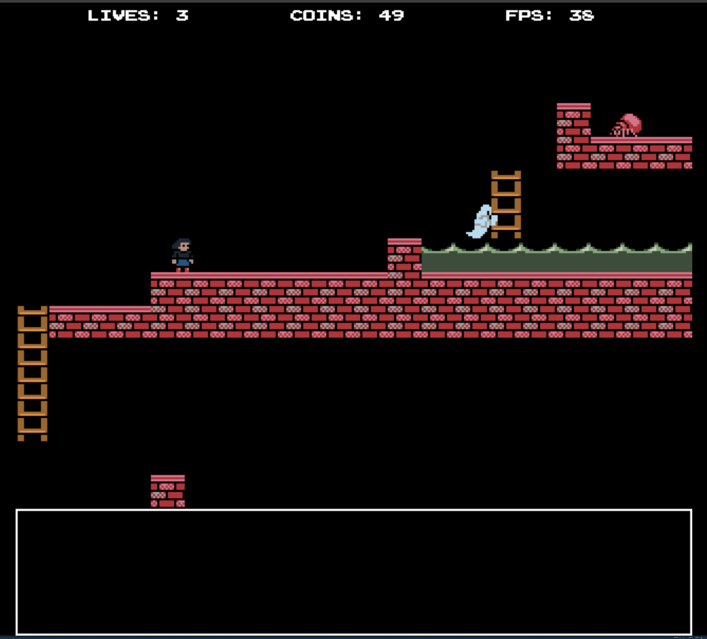

# lilypond

[](https://github.com/jadidbourbaki/lilypond-public/actions/workflows/build-linux.yml)
[](https://github.com/jadidbourbaki/lilypond-public/actions/workflows/build-mac.yml)
[](https://github.com/jadidbourbaki/lilypond-public/actions/workflows/build-windows.yml)

A free and open source (GNU GPL licensed) platformer game created that everyone can play, modify, and make their own games from. It comes with its own platform-independent game engine written in C using SDL 2. It also has a platform-independent level editor written in Rust. 

[Play it online!](https://lilyfarm.org/static/lily.html)

## Screenshots




## Building

```
make
```

To run:
```
make run
```

You will need the following dependencies:
- SDL2
- SDL2_TTF
- SDL2_Mixer
- GTK+ 3.0

If you are on Mac OS or Linux, you can use the make target

```
make dependencies
```

to install all dependencies using `homebrew` or `apt-get`.

## Building for the web

Use 

```
make build-web
```

In the `build-web` folder, you can start a simple HTTP server:

```
python3 -m http.server
```

and use it to open `lily.html` in a web browser: 

```
http://localhost:8000/lily.html
```

You will need the following additional dependency:
- emscripten

## Debugging 

To build for debugging, just use

```
make debug
```

Then you can use a debugger such as `lldb` to run the executable that contains debugging metadata.

```
lldb build-debug/lily
```

## Acknowledgements 

Please see `share/COPYING.md` for information on the licenses and credits for the content distributed for the game.